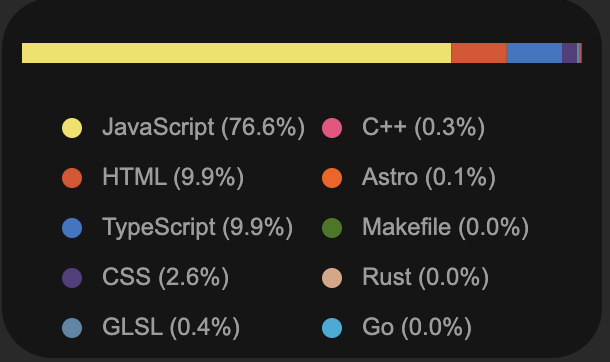

# FlareGHStats

This is a simple tool to get the stats of a GitHub user.
Built as a serverless function using [Cloudflare Workers](https://workers.cloudflare.com/).

## Usage

### Endpoints

`/lang/json?username=<username>` returns the stats of the most used languages by the user in JSON format.
`/lang/svg?username=<username>` returns the stats of the most used languages by the user in SVG format.

### Example Response

`/lang/json?username=anuraghazra`

```json
[
  {
    "language": "JavaScript",
    "size": 6237455,
    "color": "#f1e05a",
    "percentage": 0.76642
  },
  {
    "language": "HTML",
    "size": 809096,
    "color": "#e34c26",
    "percentage": 0.09942
  },
  {
    "language": "TypeScript",
    "size": 802371,
    "color": "#3178c6",
    "percentage": 0.09859
  }
]
```


`/lang/svg?username=anuraghazra`



## Deploy

### Prerequisites

- [Cloudflare Account](https://dash.cloudflare.com/)
- [Wrangler](https://developers.cloudflare.com/workers/cli-wrangler/install-update)
- GitHub Personal Access Token

### Dev 

```bash
echo "GITHUB_TOKEN=<your_github_token>" > .dev.vars
npm install
wrangler dev
curl http://localhost:8787/lang/json?username=anuraghazra
```

### Production

```bash
npm install
wrangler secret put GITHUB_TOKEN
wrangler publish
```
